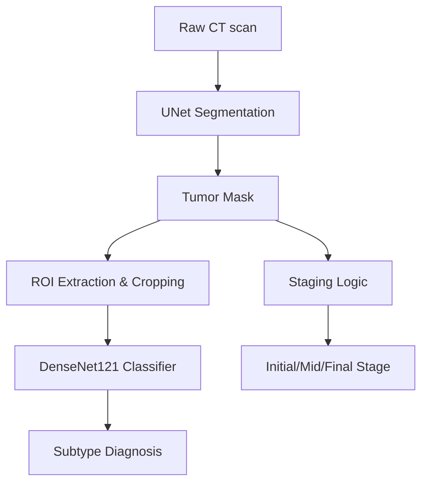

# LungInsight AI: Advanced Lung Cancer Analysis Platform 🫁

[](https://www.python.org/)
[](https://pytorch.org/)
[](https://streamlit.io/)
[](https://opensource.org/licenses/MIT)

## 📖 Overview
**LungInsight AI** is a state-of-the-art medical imaging platform designed for automated lung tumor analysis. It goes beyond simple segmentation by providing histological subtype classification and clinical staging, assisted by explainable AI (Grad-CAM) and uncertainty quantification.

## 🎯 Key Features
- **Precision Segmentation**: Pixel-level tumor identification using UNet and Attention-UNet architectures.
- **Histological Subtyping**: ROI-focused classification into **Adenocarcinoma**, **Squamous Cell Carcinoma**, and **Large Cell Carcinoma**.
- **Clinical Staging (The Roots)**: Automated staging (Initial, Mid, Final) based on tumor area thresholds.
- **Explainable AI (XAI)**: Visual interpretation of model decisions through Grad-CAM heatmaps.
- **Uncertainty Quantification**: Monte Carlo Dropout-based confidence mapping for clinical reliability.
- **Radiomics Extraction**: Automated calculation of 50+ specialized features (Shape, Intensity, Texture).
- **Interactive Dashboard**: A comprehensive Streamlit-based workspace for radiologists.

## 🏗️ Technical Architecture
The system employs a dual-stage deep learning pipeline for maximum accuracy:

1. **Segmentation Stage**: A UNet model extracts the tumor perimeter from raw CT slices.
2. **Classification Stage**: A DenseNet121 model analyzes a 2-channel ROI (Image + Mask) to determine the tumor subtype.



## � Example Outputs

### 1. Main Segmentation & Subtyping
The dashboard provides clear overlays and classification metrics.

*(Example: Adenocarcinoma detected with 94.2% confidence)*

### 2. Staging Review (Roots)
A dedicated tab for reviewing the area-based staging logic.

*(Example: Stage FINAL indicated by red color coding)*

### 3. Model Interpretability (Grad-CAM)
Understand where the model "looks" to make its prediction.


## 🚀 Getting Started

### Installation
1. Clone the repository:
   ```bash
   git clone https://github.com/your-username/LungInsight-AI.git
   cd LungInsight-AI
   ```
2. Install dependencies:
   ```bash
   pip install -r requirements.txt
   ```

### Running the Dashboard
```bash
streamlit run dashboard/app_enhanced.py
```

## 🧬 Dataset
The system is trained on diverse lung CT datasets. For more details on the data structure and volume, see [docs/dataset.md](docs/dataset.md).

## 📄 License
This project is licensed under the MIT License - see the [LICENSE](LICENSE) file for details.
