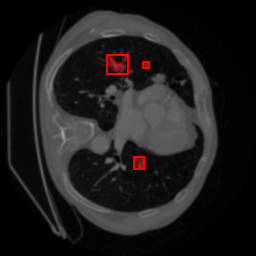
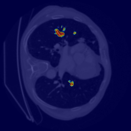
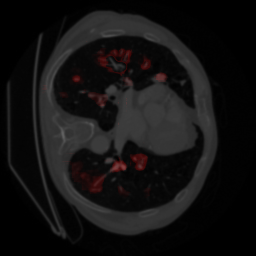

# AI Lung Cancer Detection System 🫁


## 📖 Overview
This project is an advanced, production-ready medical AI system designed for automated lung tumor segmentation and comprehensive clinical analysis from CT scans. It combines PyTorch deep learning architecture (UNet & Attention UNet) with a full Web Dashboard (Streamlit) for real-time inference, generating clinically-interpretable PDF reports securely.

## 🎯 Problem Statement
Radiological analysis of lung nodules across hundreds of CT slices is highly time-consuming and prone to human error. This system automates pixel-level tumor segmentation, computes clinical metrics (Dice, IoU), extracts 25+ quantitative Radiomics features, and visualizes model attention using Grad-CAM to assist medical professionals in rapid, accurate diagnosis.

## ✨ Features
- **Automated Tumor Segmentation**: Pixel-level tumor identification using UNet and Attention-UNet.
- **Model Explainability**: Grad-CAM heatmaps showing what the AI focuses on.
- **Uncertainty Quantification**: Confidence estimation using Monte Carlo Dropout.
- **Clinical Dashboard**: An interactive Streamlit Web UI.
- **Comprehensive Reporting**: Multi-page PDF generation detailing metrics & staging.
- **Foreign Object Detection**: Auto-detection and handling of medical implants/artifacts.

## 🛠️ Tech Stack
- **Languages:** Python
- **Deep Learning:** PyTorch
- **Computer Vision:** OpenCV, Scikit-image
- **Web Interface:** Streamlit
- **Medical Parsing:** pydicom, nibabel

## 🏗️ Project Architecture
```text
Dataset (CT Scans / DICOM / NIfTI)
   ↓
Preprocessing Pipeline (Denoising, Resizing, Normalization)
   ↓
Deep Learning Inferencing (PyTorch UNet / Attention UNet)
   ↓
Post-Processing (Morphology, Object Handling)
   ↓
Clinical Dashboard (Streamlit GUI & PDF Generation)
```

## 🚀 Installation & Setup

1. **Clone the repository:**
```bash
git clone https://github.com/your-username/lung-cancer-detection-ai.git
cd lung-cancer-detection-ai
```

2. **Install dependencies:**
```bash
pip install -r requirements.txt
```

3. **Run the Dashboard:**
```bash
streamlit run app_enhanced.py
```

## 📊 Training the Model
To retrain the models locally on your dataset:
```bash
# Basic Training
python train.py

# Advanced Training (with Focal Tversky Loss, etc.)
python train_advanced.py --loss focal_tversky --model attention_unet --epochs 50
```

## 📸 Dashboard Interface
*Our system generates comprehensive visual interpretation beyond standard segmentation.*

### 1. Tumor Segmentation


### 2. Grad-CAM Interpretation


### 3. Uncertainty Quantification


## 🔮 Future Improvements
- Extend segmentation to full 3D Volumetric Analysis.
- Migrate web dashboard to a robust FastAPI + React architecture.
- Integrate PACS/Hospital System pipeline.

## 📄 License
This project is licensed under the MIT License - see the `LICENSE` file for details.
